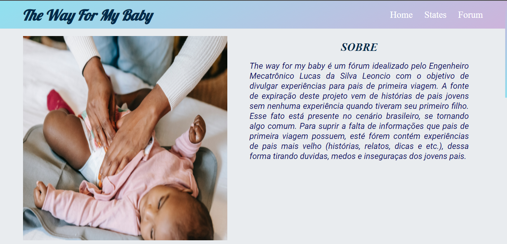
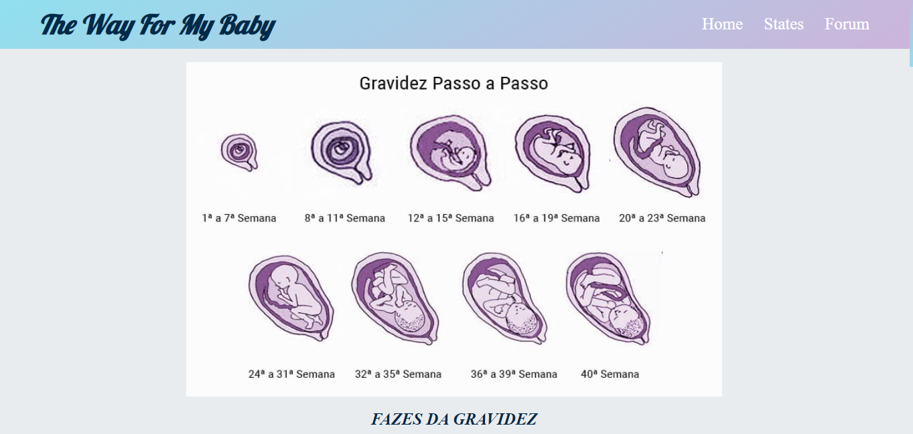
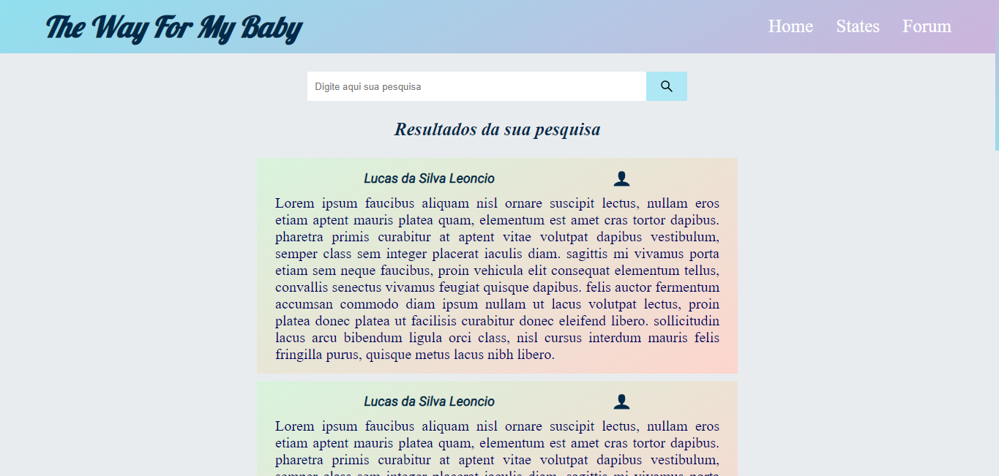

# The Way for my Baby

Esse projeto desenvolvido pelo desenvolvedor Lucas da Silva Leoncio, tem a finalidade de simular um fórum digital. Esse fórum tem como foco sanar duvidas sobre maternidade e paternidade. Além disso, esse projeto possui duas páginas extras, no caso, a Home e o States. 
A home cotém a introdução e explicação de como funciona o site, fazendo uma descrição simples e direta.

A página States faz uma descrição das fase da gestação e como está caminhando o desenvolvimento da criança.

## Sobre o fórum:

O fórum pode ser dividido em duas partes.

A primeira é a região é responsável em apresentar os resultados da pesquisa, aprensentando eles com auxilio de card feito pelo desenvolvedor. No topo dessa área existe uma caixa de pesquisa onde o usuário pode digitar o assunto da pesquisa.

A segunda parte contém um form onde uma pessoa pode digitar um assunto e sua experiência para ajudar outras pessoas.

Nesse Form possui três Inputs para colocar o Nome completo, email e o assunto, além disso, um áreaText para armazenar o depoimento.

